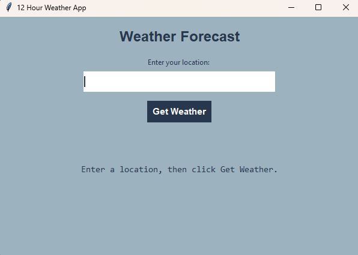
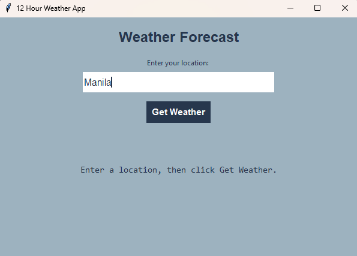
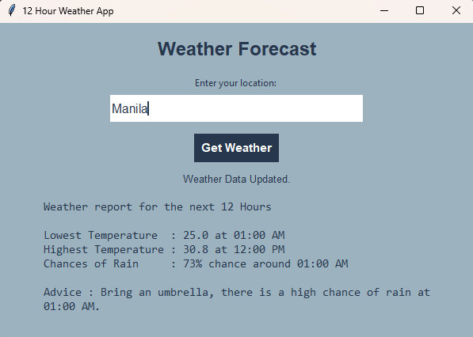

# 12-Hour Weather App

A Python desktop weather application built with Tkinter. Enter a Philippine location to view its weather forecast for the next 12 hours, including the highest and lowest temperature, peak rain probability, and practical weather advice.

## Features

- Searches for Philippine locations with the Open-Meteo Geocoding API
- Displays the next 12 hours of weather data
- Shows the lowest and highest forecast temperature and their times
- Shows the highest chance of rain and its expected time
- Advises the user to bring an umbrella when rain probability is 50% or higher
- Advises the user to stay hydrated when the temperature is 33°C or higher
- Uses threading so the interface stays responsive while requesting weather data

## Technologies Used

- Python
- Tkinter
- API

## How It Works

1. The user enters a Philippine location in the application.
2. The app searches for the location using the Open-Meteo Geocoding API.
3. The selected location's latitude and longitude are used to request hourly weather data.
4. The app analyzes the next 12 hours to find the highest temperature, lowest temperature, and peak rain probability.
5. The forecast and weather-based advice are displayed in the graphical interface.

## Screenshots

### Main Interface


### Location Typed


### Weather Forecast


## Installation

### Option 1: Run from Source

1. Clone this repository.
2. Make sure Python is installed on your computer.
3. Open the project folder in your terminal.
4. Install the required package:

```bash
pip install requests
```
5. Run the application using:

```bash
python main.py
```